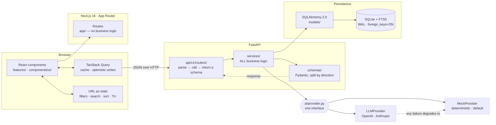

# Fireflies.ai Clone


An AI meeting-notetaker: a searchable meetings library, an interactive transcript wired
bidirectionally to a media player, AI-generated summaries and extracted action items.

The badge is the measured `pytest --cov` number over `services/`, `ai/` and `parsers/`
(target ≥80%, per T-43.12); regenerate with `make coverage`.

**Live demo:** <http://8.231.115.48:8600> — auto-deployed from `main` (see [deploy/README.md](deploy/README.md)) · **Repository:** https://github.com/AnshSinghal/FireFlies-Clone

---

## Screenshots

_(Captured in T-45.2: notebook, notepad, dark mode, and a GIF of transcript ↔ player sync.)_

---

## Overview

Every row below maps to a Core Feature bullet from the assignment brief. The right-hand column
names the test that proves it, because a claim in a README is worth what its evidence is worth —
the full mapping, including Playwright IDs, is in **[e2e/COVERAGE.md](e2e/COVERAGE.md)**.

| Core feature | | Where it is proved |
|---|:--:|---|
| Past meetings list — title, date, duration, participants | ✅ | `08-notebook.spec.ts`, `11-details.spec.ts` |
| Search and filter by title, date, participant | ✅ | `09-filters.spec.ts` |
| Sort by recency | ✅ | `09-filters.spec.ts › sorting` |
| Navbar with profile and settings | ✅ | `05-topbar.spec.ts`, `24-placeholders.spec.ts` |
| Interactive transcript — speaker labels, timestamps | ✅ | `15-transcript.spec.ts` |
| Media player with seek bar | ✅ | `14-player.spec.ts` |
| **Click a transcript line → the player seeks, and vice versa** | ✅ | `16-sync.spec.ts` (T21-A → T21-N, both directions and the edges) |
| Search within the transcript, matches highlighted | ✅ | `17-find.spec.ts` |
| AI-generated meeting summary | ✅ | `18-summary.spec.ts` — see the note on the provider below |
| Action items extracted from the transcript | ✅ | `19-action-items.spec.ts` |
| Key topics, outline, chapters | ✅ | `18-summary.spec.ts`, `16-sync.spec.ts` (T21-J) |
| Create a meeting — upload, paste, or form | ✅ | `21-create.spec.ts`, `90-mutations.spec.ts` |
| Edit meeting metadata | ✅ | `22-edit.spec.ts` |
| Delete a meeting | ✅ | `23-delete.spec.ts` (+ undo) |
| Add, edit and complete action items | ✅ | `19-action-items.spec.ts` (T24-O cross-view badge sync) |
| All data persists across reloads | ✅ | pytest round-trips; `90-mutations.spec.ts` re-reads after reload |
| Loading, empty and error states | ✅ | `12-states.spec.ts` |
| Notifications / toasts | ✅ | `06-toasts.spec.ts` |

**The one qualification worth reading.** Summaries, outlines, keywords, action items and Q&A are
real features with real output, but the **default provider is deterministic classical IR, not a
language model** — TF-IDF keywords, TextRank-style extraction, regex commitment patterns. That is a
deliberate choice, not an unfinished one: it makes the demo reproducible, offline, free, and
snapshot-testable. `AI_PROVIDER=openai|anthropic` swaps in a real model through the same interface.
The UI always names which provider produced what it is showing.

### Deliberately not built

Each of these is a surface in the app that says so honestly, rather than a dead link.

| | | Why |
|---|:--:|---|
| Authentication | ❌ | Out of scope per the brief. One seeded user behind a `get_current_user` dependency — the single place real auth would attach |
| Speech-to-text | ❌ | Transcripts are uploaded or pasted. The audio pipeline is the mocked boundary |
| Live meeting bot | 🚧 | Placeholder surface (T-30.6) |
| Calendar / Slack / CRM integrations | 🚧 | Placeholder surface (T-30.3) |
| Teams and sharing | 🚧 | Placeholder surface (T-30.4) |

### Bonus features, all shipped

| Bonus | | Notes |
|---|:--:|---|
| Comments and threads on transcript lines | ✅ | `25-comments.spec.ts` |
| Highlights and bookmarks | ✅ | Character-exact ranges that survive a transcript edit — `27-highlights.spec.ts` |
| Soundbites | ✅ | Trimmable, range-locked clips — `26-soundbites.spec.ts` |
| Export — Markdown, TXT, PDF, DOCX | ✅ | `34-export.spec.ts` + renderer tests in pytest |
| Global search across all meetings | ✅ | FTS5-ranked, deep-linkable — `24-search.spec.ts` |
| Tags and topics with OR/AND filtering | ✅ | `27-tags.spec.ts` |
| AskFred — Q&A over a transcript with citations | ✅ | Citations seek the player — `26-askfred.spec.ts` |
| Dark mode | ✅ | System-tracking, axe-clean in both themes — `25-dark-mode.spec.ts` |

---

## Tech Stack

| Layer | Choice | Why |
|---|---|---|
| Frontend | Next.js 16 (App Router, TypeScript strict) | File-based routing, first-class TS, and `next/font` for self-hosted Inter |
| Styling | Tailwind CSS v3 + CSS custom properties | Tailwind's palette is *replaced* by semantic tokens, so an off-palette colour is a build error — see [ADR-002](docs/decisions.md) |
| Data fetching | TanStack Query v5 | Cache invalidation across notebook / drawer / notepad is the hard part of this app |
| Backend | FastAPI + SQLAlchemy 2.0 + Alembic | Typed request/response models and auto-generated OpenAPI |
| Database | SQLite + FTS5 | The brief specifies SQLite; FTS5 gives real ranked search with no external service |
| AI | Pluggable provider | `MockProvider` (deterministic, offline, default) or a real LLM behind one env var |
| Testing | Playwright + pytest | E2E for the graded interactions, pytest for services, parsers and the AI layer |

---

## Architecture



The dashed boxes are the swappable ones. `services/` depends on the **interface**, never on either
implementation, which is why `AI_PROVIDER` is a one-variable change and why any LLM failure can fall
back to the mock without a caller knowing.

The backend is strictly layered:

```
api/v1/routers/   thin — parse the request, call a service, return a schema
services/         ALL business logic
models/           SQLAlchemy ORM
schemas/          Pydantic — routers never return ORM objects
```

Routers contain no ORM access. This is enforced by `scripts/check_layering.py`, which runs in
`make lint`, the pre-commit hook and CI.

### AI provider (T-29)

Summaries, outlines, keywords, action items and Q&A all go through one interface
(`app/ai/provider.py`) with two implementations:

- **`MockProvider`** — the default (`AI_PROVIDER=mock`). Deterministic classical IR: TF-IDF
  keywords, pause/speaker-turn topic segmentation for the outline, TextRank-style extractive
  overview, regex commitment patterns for action items, term-overlap retrieval for Q&A. Same
  transcript in, byte-identical output out — which is what makes it testable and safe for
  visual-regression snapshots.
- **`LLMProvider`** — OpenAI or Anthropic, selected by `AI_PROVIDER` + `AI_API_KEY`
  (+ optional `AI_MODEL`). Structured output against JSON schemas derived from the same
  pydantic types the rest of the app consumes, so parsing is validation, not regex-on-prose.

Around them: prompts as versioned Markdown files (`app/ai/prompts/`), a response cache keyed on
`hash(transcript + prompt versions + provider)` so identical input never re-bills, and a fallback
chain — any LLM failure (timeout, rate limit, bad key) logs, degrades to the mock, and records
`provider = "mock (llm fallback)"` so the UI's attribution line stays honest. The demo can never
hard-fail because of an API key.

**Chunking strategy for long transcripts (map-reduce).** LLM context is finite and cost scales
with input, so transcripts over ~3,000 tokens are split on segment boundaries into ~3,000-token
chunks with a ~200-token overlap (a commitment made in the last sentence of chunk *N* is the
context for the first sentence of chunk *N+1*). Each chunk is summarised independently (map),
then the chunk summaries are synthesised into one summary with the same prompt (reduce); notes
keep the mapped, transcript-grounded versions. List-shaped extractions merge instead: keywords by
max weight, outline entries by strictly-increasing timestamp (which also dedupes the overlap
region), action items by normalised text. Q&A retrieves the single most relevant chunk
client-side before asking. A token pre-check refuses absurd inputs (~350k tokens) before they
cost money. The mock path doesn't need any of this, but the seam is where a real model plugs in.

---

## Database Schema

SQLite with FTS5. Full ERD, per-column rationale and the design decisions behind it are in
**[docs/schema.md](docs/schema.md)**.

| Table | Purpose | Notable |
|---|---|---|
| `users` | Accounts | Auth is out of scope; the table exists so authorship is a real FK |
| `meetings` | Aggregate root | Soft-deleted via `deleted_at`; `duration_seconds` denormalised |
| `participants` | Attendance, per meeting | `user_id` nullable — most attendees have no account |
| `speakers` | Raw transcript labels | Decouples `Speaker 1` from a person, so renaming is one UPDATE |
| `transcript_segments` | One speaker turn | `start_ms`/`end_ms` INTEGER milliseconds; ~1,200 rows for a long meeting |
| `summaries` | Scalar summary fields | One per meeting; carries provider provenance and an `is_stale` flag |
| `summary_sections` | Outline chapters, note groups | `start_ms` is what makes the outline clickable |
| `action_items` | Tasks | First-class rows, not a JSON blob — independently mutable |
| `keywords` | Salient terms | Weighted, so the UI's top-six ordering is meaningful |
| `channels`, `tags`, `meeting_tags` | Organisation | One channel per meeting, many tags |
| `comments`, `highlights`, `bookmarks`, `soundbites` | Collaboration (Phase 6) | Created up front so the schema is stable |
| `transcript_fts` | FTS5 virtual table | Trigger-maintained; gives ranked search instead of `LIKE '%x%'` |

**Design decisions worth knowing:**

- **Soft delete.** Deleting a meeting sets `deleted_at`. It vanishes from the UI but stays
  restorable, which is what makes the undo affordance honest rather than a re-created lesser copy.
- **Two denormalised columns**, both justified by the same access pattern: `meetings.duration_seconds`
  and `participants.talk_seconds` would otherwise mean an aggregate over hundreds of segments for
  every row of every Notebook page.
- **`speakers` sits between segments and people** so renaming a speaker is one statement rather than
  one per segment, and a speaker can stay unresolved indefinitely.
- **Milliseconds are integers**, never formatted strings — the transcript↔player sync depends on
  exact comparisons.
- **The FTS index survives a soft delete**, so all search goes through `app/db/search.py`, which
  joins back to `meetings` and filters. Asserted from both sides in `tests/test_schema.py`.

Migrations are in `backend/alembic/versions/` and are committed — the app never calls
`create_all()`. Apply them with `make migrate`.

---

## API Overview

Full endpoint table, conventions and worked examples: **[docs/api.md](docs/api.md)**.
Interactive docs at **`/docs`** on the running backend.

Every list endpoint returns the same envelope, and every error — including FastAPI's own 404 on an
unknown route — returns `{ error: { code, message, details } }`. Branch on `code`; it is stable.

```bash
curl localhost:8000/api/v1/meetings          # paginated, light row shape
curl localhost:8000/api/v1/meetings/1        # 404 unknown · 410 deleted (restorable)
curl localhost:8000/api/health               # runs a real SELECT 1; 503 when the DB is down
```

The TypeScript client at `frontend/src/types/api.d.ts` is generated from the schema — run
`make types` after changing an endpoint, so a backend field rename surfaces as a frontend type error
rather than a runtime `undefined`. A test fails the build if the committed schema falls behind.

---

## Setup

### Prerequisites

| Tool | Version | Needed for |
|---|---|---|
| Docker + Compose | 24+ / v2+ | The one-command path |
| Node.js | 20+ | Manual path, and the E2E suite |
| Python | 3.12+ | Manual path |
| [uv](https://docs.astral.sh/uv/) | latest | Manual path (Python deps) |

### Quick start (Docker)

```bash
git clone https://github.com/AnshSinghal/FireFlies-Clone.git
cd FireFlies-Clone
cp .env.example .env
make dev
```

Frontend on http://localhost:3000 · API on http://localhost:8000 · API docs on
http://localhost:8000/docs

Populate the database with realistic demo data:

```bash
make seed-demo    # reset, seed, validate, and print a summary
```

Eight meetings with genuine transcripts — 607 segments, 38 action items across every badge state,
15 people, dated from today back to two months ago so every date filter has data on both sides.
Timings, durations and talk-time are **derived from the transcripts**, never authored, so nothing in
the seed can contradict itself.

### Manual (no Docker)

```bash
cp .env.example .env

# Backend — http://localhost:8000
cd backend && uv sync && uv run uvicorn app.main:app --reload

# Frontend — http://localhost:3000 (separate terminal)
cd frontend && npm install && npm run dev
```

### Commands

| Command | Does |
|---|---|
| `make dev` | Both apps via Docker Compose |
| `make seed` | Reset and populate the demo database |
| `make test` | Backend test suite (pytest) |
| `make coverage` | Backend tests with the coverage report (services/ai/parsers, target ≥80%) |
| `make e2e` | Playwright end-to-end suite |
| `make lint` | Lint + typecheck both apps and check backend layering |
| `make format` | Auto-format both apps |

---

## Assumptions & Scope

Known scope boundaries, all deliberate. Each one is a decision with a reason, not a thing that ran
out of time:

- **Authentication is out of scope** per the assignment. A single seeded default user is returned by
  a `get_current_user` dependency — the one place real auth would be wired in. The profile menu
  shows that user, and `Sign out` says so via the coming-soon toast instead of pretending (T-30.8).
- **Speech-to-text is out of scope.** Transcripts are uploaded or pasted, not generated from audio.
- **Summaries default to a deterministic offline provider**, not a live LLM, so the demo cannot fail
  on a missing API key or a rate limit. Switching to a real model is a one-variable change.
- **Deletes are soft.** Meetings disappear from the UI but remain restorable. That is what makes the
  undo affordance honest — Undo restores *the row*, rather than re-creating a lesser copy of it. The
  cost is that the FTS index still contains soft-deleted segments, so every search path joins back to
  `meetings` and filters; asserted from both sides in `tests/test_schema.py`.
- **Integrations and the live meeting bot are out of scope.** Calendar, Slack, CRM and the
  notetaker-that-joins-your-call are the parts of Fireflies that are mostly other people's APIs and a
  media server. They exist here as placeholder surfaces that say so (T-30), not as dead links.
- **Two of the eight seeded meetings carry real audio**, not all eight. The file is 18 minutes of
  band-limited brown noise generated with ffmpeg (`backend/media/README.md` has the command) — it is
  not a recording of anything. Two is the number that matters: it makes the player exercise a genuine
  `<audio>` element with real `buffered` ranges, `timeupdate` events and HTTP Range seeking, which is
  what T-19 and T-21 are actually about. The other six drive the same UI from a virtual clock, which
  is the fallback path and also needs to be exercised. Committing eight real files would have added
  ~13MB to the repository to test nothing new.
- **The seed is small on purpose** — eight meetings, 607 segments, 15 people. Enough that every filter
  has data on both sides of it, few enough that the numbers are checkable by hand. Stress behaviour is
  tested where it belongs instead: a synthetic 5,000-segment meeting in `34-stress.spec.ts` and
  `backend/tests/test_performance.py`.

---

## Testing

**440 backend tests** across 27 files and **548 end-to-end tests** across 44 spec files, all green.

| Suite | Tests | Runs in | Covers |
|---|---|---|---|
| pytest | 440 | ~28s | Services, parsers, the AI layer, schema invariants, latency budgets |
| Playwright `read-only` | ~430 | ~3m | Every read surface, in parallel |
| Playwright `mutations` | ~90 | ~1m | Writes, serialised — they share one database |
| Playwright `chromium-mobile` | 36 | ~26s | The 393px layout (`@mobile`) |
| Playwright `visual` | 16 | ~20s | Screenshot comparison (`@visual`) |
| Playwright `firefox` + `webkit` | 16 | ~17s | Platform seams only (`@crossbrowser`) |

Backend coverage is **95%** over `services/`, `ai/` and `parsers/` — the plan's target is 80%.
Regenerate with `make coverage`, which writes `backend/htmlcov/index.html`.

The e2e total exceeds the number of `test()` declarations because the `@mobile`, `@visual` and
`@crossbrowser` tags run the same declaration in more than one project. Both numbers are honest; the
executed count is the one printed by `make e2e`.

Which tests found which bugs — the more useful question at interview — is answered in
**[docs/interview-notes.md](docs/interview-notes.md) §8**.

```bash
make verify      # Everything CI runs, in CI's order — the one to use before pushing
make test        # Backend suite (pytest)
make e2e         # End-to-end suite (Playwright)
make lint        # Both apps' linters + formatters + the backend layering check
make typecheck   # mypy --strict and tsc --noEmit
```

`make verify` exists because running the parts is not the same as running the gate. CI went red
three times on `ruff format --check` and `prettier --check` while `ruff check`, `eslint` and `tsc`
were all green locally — the formatters are part of `lint`, and nothing had been running `lint`.

Playwright starts its own copies of both apps on ports **3140/8140**, so `make dev` can stay running
on 3000/8000 while the suite executes, and a run can never accidentally test whatever else happens to
be listening. Override with `E2E_FRONTEND_PORT` / `E2E_BACKEND_PORT`.

First run needs the browser binaries:

```bash
cd e2e && npm install && npx playwright install chromium firefox webkit
```

All three engines, because `npm test` runs every project and the `@crossbrowser` set (T-42.12)
lives in two of them. That set is deliberately small — the platform seams only: the autoplay policy
WebKit enforces, sticky positioning inside a scroll container, DOM-range normalisation under the
selection toolbar, a canvas painted from CSS custom properties, and the transcript↔player seek.
Re-running four hundred assertions in three engines would buy almost nothing; the majority exercise
our own React state, which does not vary by engine.

```bash
make e2e-crossbrowser   # just those, in Firefox and WebKit
```

---

## Performance

Measured on the merged tree, gzipped at nginx's compression level. **The plan's 250KB route-JS
budget (T-42.9) is not met**, and the suite asserts a regression guard at the measured level rather
than a green tick over an unmet target — the gap is printed in the failure message and stated in
`e2e/tests/32-bundle.spec.ts`.

| Route | JS (gzipped) | Plan target | CLS |
|---|---|---|---|
| `/notebook` | 288KB | 250KB | < 0.1 ✅ |
| `/meeting/[id]` | 349KB | 250KB | < 0.1 ✅ |
| `/search` | 301KB | 250KB | — |
| `/settings` | 301KB | 250KB | — |

Where it goes: `react-dom` is 69KB and the Next runtime 54KB, so **123KB is framework floor** before
a line of this app is counted. The remainder is roughly even between Radix primitives (~48KB across
a dozen packages), TanStack Query and Virtual (~60KB), and application code (~57KB).

The reductions actually available were taken — the export modal and the AskFred panel are
`next/dynamic`, and the notepad-only leaves (virtualiser, waveform decoder, date picker) were
verified absent from the notebook's payload rather than assumed to be. Closing the remaining gap
means dropping Radix or TanStack Query, which is a product decision rather than a build-config one.

Compression itself was a real find: nothing in the deployed chain was gzipping. `next start`
compresses its HTML and RSC responses but serves `/_next/static` untouched, and the nginx entry
point had no `gzip` block — so every visitor was downloading ~2.7× these numbers. Fixed in
`deploy/nginx-fireflies.conf`.

### Lighthouse (T-42.7)

Run against the deployed origin with Chrome's mobile emulation, which is the profile that finds
things a 1440px suite cannot.

| Route | Performance | Accessibility | Best Practices |
|---|---|---|---|
| `/notebook` | 79 | **95** ✅ | 79 |
| `/meeting/[id]` | 82 | 93 → **100** after the fixes below | 79 |

Plan targets: Performance ≥ 85, Accessibility ≥ 95, Best Practices ≥ 95.

**Best Practices** is entirely `is-on-https` and `redirects-http`. The demo is served over plain
HTTP on a bare IP — there is no domain to issue a certificate against — so this is an infrastructure
limit, not a code one. Put it behind a hostname with TLS and the category is 100.

**Performance** is LCP: 4.0s against FCP 0.8s, CLS 0, Speed Index 1.1s. The shell paints fast and
the largest element is the meeting list, which waits on a client-side fetch. The fix is to render
the first page on the server — real work, and a change to the RSC-vs-client-data decision recorded
in ADR-001 rather than a tuning pass, so it is written down rather than half-done.

Lighthouse earned its keep three times over, and every finding is one a 1440px axe sweep
structurally cannot see:

- The topbar's **New** button had no accessible name below 768px, where its label is
  `hidden md:inline`. On desktop it reads "New"; on a phone a screen reader announces "button".
- A **completed action item** put `text-muted` (#667085) on `bg-success-subtle` (#d7fbe3) — 4.45:1,
  a hair under AA. Now `text-success-strong`, which is 5.67:1 and is the convention the token layer
  already documents: base hues for icons and fills, `-strong` for text on the matching subtle
  background.
- The **timestamp chips** — the control you tap to jump to the moment a line was said — were 42×16,
  against WCAG 2.2's 24×24 minimum. Two thirds of a finger too short, on the primary action of the
  notepad's phone layout.

`28-a11y.spec.ts` now sweeps 393px as well, so the first of those cannot come back.

Backend latency budgets (T-42.10) and the 5,000-segment stress case (T-42.11) are asserted in
`backend/tests/test_performance.py`. Two of those assert a *ratio* rather than a stopwatch reading,
because the ratio is what stays true on someone else's hardware: a page of 20 must not slow down as
the corpus triples, and the last page of a 5,000-segment transcript must cost what the first one
does — the property cursor pagination exists for.

---

## Project Structure

```
├─ frontend/          Next.js app (App Router, TypeScript)
├─ backend/           FastAPI service, layered routers → services → models
├─ e2e/               Playwright suite, owns its own package.json
├─ docs/              ADR log, schema and API documentation
├─ scripts/           Repo-level checks (layering enforcement)
├─ design.md          Design tokens and layout reference
├─ PLAN.md            Full implementation plan (46 tasks)
└─ docker-compose.yml
```

---

## What I'd Do Next

_(Written in T-45.12.)_
